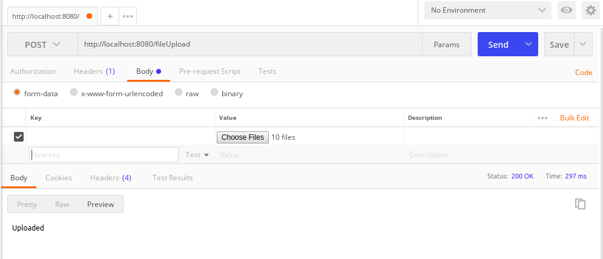

Akka File Upload Scala
---

This project is a sample for how to upload file using akka-stream and akka-http.

### Step to run

Start HTTP server

```sbt run```

Then make a HTTP POST Call on following url:

```http://localhost:8080/fileUpload```

For Example (Postman):




